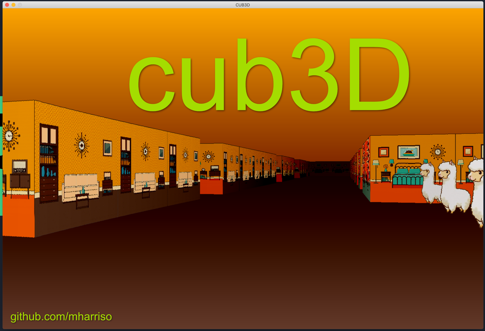
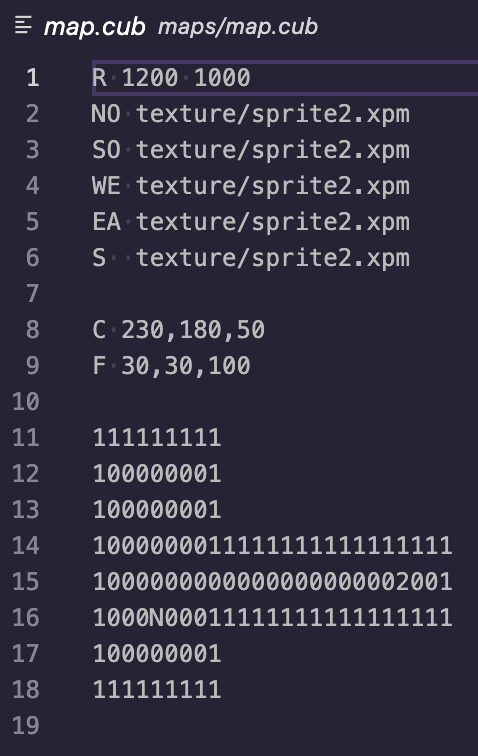

# Cub3D


Raycasting project (21-school / Ecole 42)


How it looks:


## Setup and usage

```
git clone https://github.com/mharriso/Cub3D.git
cd Cub3D
make
./cub3D ./maps/alpaca_hotel.cub
```
## Screenshot

First frame will be saved to the cub3D folder as screenshot_cub3d.bmp
```
./cub3D ./maps/alpaca_hotel.cub --save
```

### Controls
```
W A S D					move
←					turn left
→					turn right
```
### Configuration file 
```
Config file called `map.cub`

R 					resolution
C					ceiling rgb color
F					floor rgb color
NO SO WE EA				paths to textures
S					path to sprite
					empty lines

valid map is surrounded by walls (1) and can contain these characters
1					wall
0					player can move here
2					sprite/item
N S E W					player position and view direction
space					empty space (player can't see them)

map can't be splitted by empty lines
```
Example of a valid config file:



